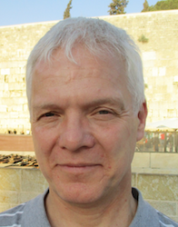

## Special Event In June 2018

We are pleased to announce that <strong> Zoltán Dörnyei (University of Nottingham, UK)</strong> will be joining us for a presentation on June 16th following his plenary at the third international Psychology of Language Learning conference (PLL3) in Tokyo (June 7-10).

Information on the time and venue are on the <a href="/chapters/kq/schedule/2018/June/16">schedule page</a>. This event is co-sponsored by the JALT Mind, Brain, and Education SIG with support from PLL3.

Register for the presentation online at http://kqjalt-dornyei.peatix.com/. You can also register and pay onsite from 3:30 pm.

<a href="/chapters/kq/content/access-details-dornyei"><strong>Access details here</strong></a>
 

<h3>Directed Motivational Currents: What Are They and What Can They Teach Us About Long-term Motivation?</h3>

Most people will have come across a curious phenomenon whereby somebody suddenly embarks on a project, invests a great deal of time and energy in it for a period of time and, as a result, often achieves something quite remarkable. This paper  discusses this phenomenon and introduces a novel psychological construct to describe it, ‘Directed Motivational Current’ (DMC). It refers to an intense motivational drive capable of both stimulating and supporting long-term behaviour, such as learning a foreign/second language. DMCs involve unique periods of heightened motivational involvement whereby individuals pursue a goal/vision which is considered personally significant, highly relevant to one’s desired identity and emotionally satisfying – the experience of a DMC carries with it the excitement of journeying down a ‘motivational highway’ towards new pastures. Although such surges occur in numerous guises within the social world, they are admittedly not very frequent and their duration is also limited. This being the case, do they have a more general significance for motivation theory? I will argue in this talk that they do, because DMCs represent an optimal form long-term motivation, one which occurs when all the necessary conditions and components of motivated action are present and act as a harmonious whole. It may be no exaggeration to regard almost any form of long-term motivation as a partial realization of a DMC and, accordingly, understanding how and why a DMC happens will allow us to identify the principal building blocks of sustained motivated behaviour.

<strong>Zoltán Dörnyei</strong> ((PhD in Psycholinguistics, Budapest; PhD in Theology, Durham) is Professor of Psycholinguistics at the School of English, University of Nottingham. He has published extensively on various aspects of language learner characteristics and second language acquisition, and he is the author of over 25 books, including <cite>Motivational Strategies in the Language Classroom</cite> (2001, Cambridge University Press), <cite>Research Methods in Applied Linguistics</cite> ( 2007, Oxford University Press), <cite>Motivating Learners, Motivating Teachers: Building Vision in the Language Classroom</cite> (2014, Cambridge University Press, with M. Kubanyiova), <cite>The Psychology of The Language Learner Revisited</cite> (2015, Routledge, with S. Ryan) and <cite>Motivational Currents in Language Learning: Frameworks for Focused Interventions</cite> (2016, Routledge, with A. Henry and C. Muir).